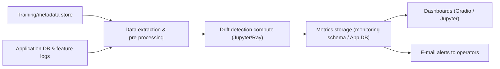
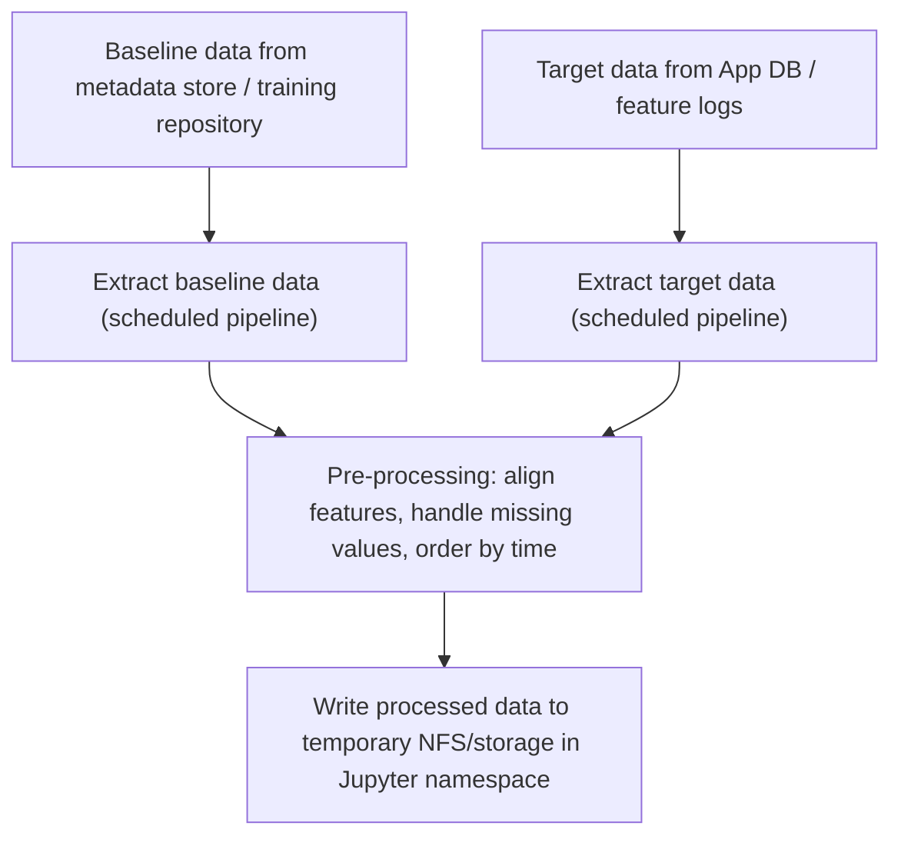
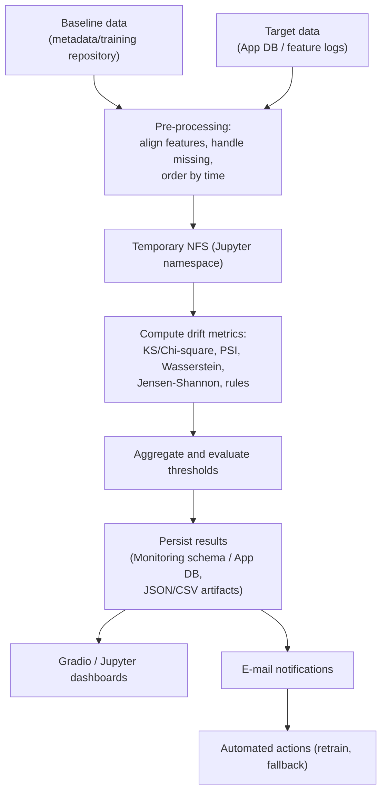
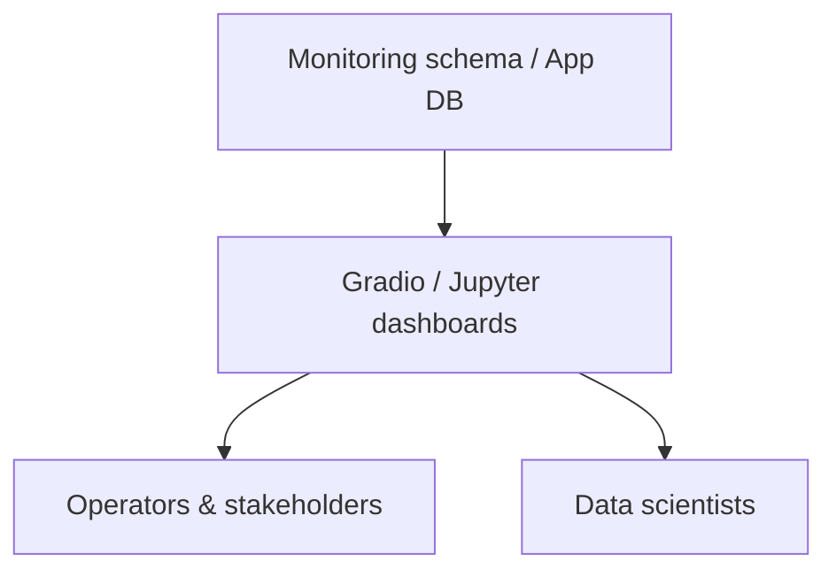
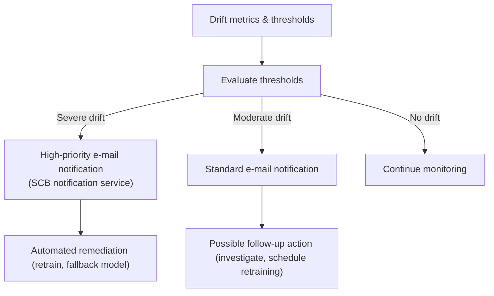
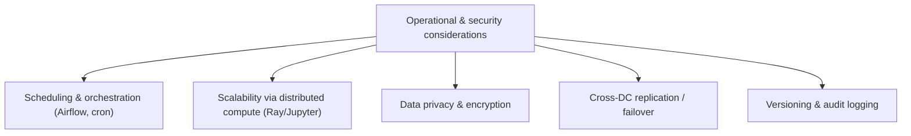
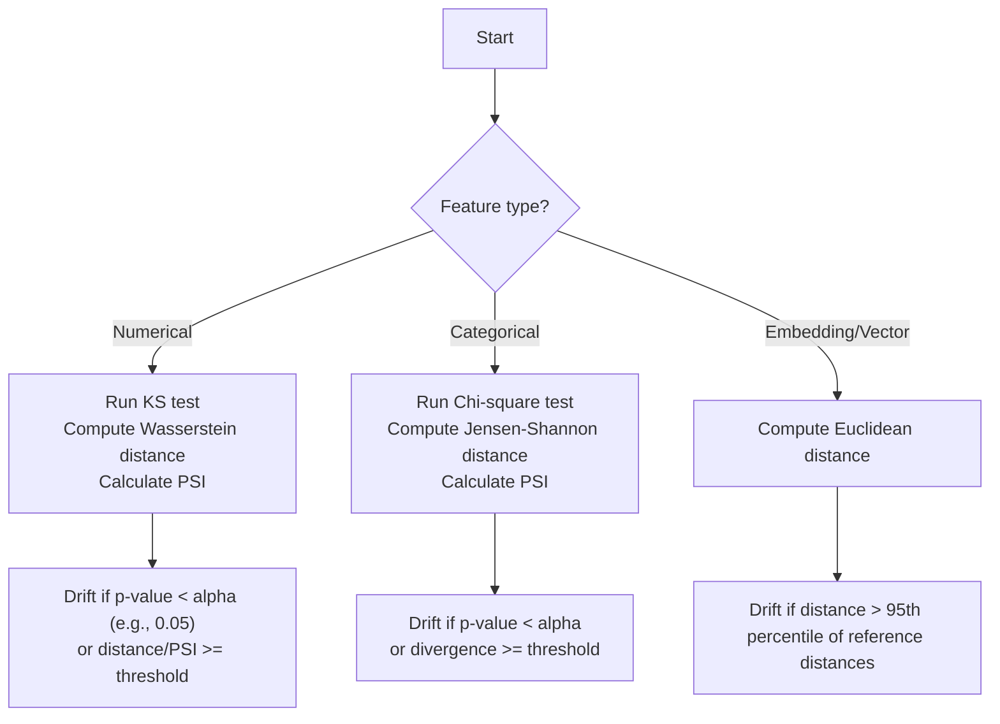

# High‑Level Solution Design: Integrating Drift Monitoring into the AI‑Factory on‑Prem Platform

### High‑level overview diagram

*Figure 0: High‑level overview of the drift monitoring solution.  Baseline and current data feed into the drift monitoring pipeline, which produces metrics and reports.  These results flow into dashboards for visualization and into an e‑mail alerting mechanism that notifies operators and can trigger automated responses.*

### High‑level checklist

- [x] Define data extraction and pre‑processing flow
- [x] Implement drift detection compute (Jupyter/Ray)
- [x] Persist metrics to monitoring schema / App DB
- [x] Wire dashboards (Gradio / Jupyter) to metrics
- [x] Configure e‑mail alerts to operators
- [ ] Depict Cross‑DC replication in high‑level diagram
- [ ] Add legend for KS, PSI, JS, KL near diagrams
- [ ] Optionally show Vault/SSO and Grafana/Elastic as side boxes
- [ ] Add “How to run” steps for metrics and dashboards
- [ ] Document required environment variables
- [ ] Add CI/pre‑commit to lint/validate Mermaid blocks
- [ ] Deploy drift monitoring to SKE cluster

## 1 Context and Objectives

Modern machine‑learning (ML) systems continuously ingest new data.  As the distribution of that data drifts from the data used to train the model, predictive quality degrades and silent failures can occur.  According to Microsoft’s dataset monitoring documentation, dataset monitors help analyze drift over time, compare baseline and target datasets, profile features and set up **alerts on data drift for early warnings**【417316806847047†L158-L167】.  In a typical ML environment, **issue detection and alerting** on drift serve as the first line of defence; well‑designed monitoring enables root‑cause analysis and can trigger automated responses such as retraining or fallback models【294203861796179†L229-L248】.

The AI‑Factory on‑Prem Architecture (see the figure below) provides a secure, self‑hosted environment for building and deploying ML models.  It includes:

* **Compute clusters** – master and worker nodes running Kubernetes (Mosaic on‑prem) and GPU clusters.
* **Jupyter namespaces** with a load‑balanced login UI and API; these are where data scientists run notebooks and scheduled pipelines (via **Ray** or **Airflow**).
* **Internal services** – Artifactory for DevOps, SCB vault and SSO for security, Grafana/Elastic for monitoring, and an application database for storing model metadata and results.
* **Cross‑DC replication** – metadata and data are replicated between Hong Kong and Singapore DCs for resilience.

*Figure 1. The AI‑Factory on‑Prem Architecture shows master and worker nodes, Jupyter namespaces, GPU compute, internal services (Artifactory, SCB Vault, Grafana/Elastic), SSO, key management, and cross‑data‑center replication.  This provides the infrastructure on which the drift monitoring pipeline operates.*

To introduce drift monitoring into this platform, we propose a pipeline that acquires data, computes drift metrics, stores results, populates dashboards and issues alerts.  The sections below outline the proposed design.

## 2 Data Acquisition

### 2.1 Identify baseline and target datasets

Drift detection relies on comparing a **baseline dataset** (often the training data) to a **target dataset** (recent inference data).  Guidelines for drift monitoring suggest that you should monitor **new data for differences between any baseline and target dataset** and profile features to track how statistical properties change【417316806847047†L158-L165】.  In our setting:

* **Baseline data** – retrieved from the metadata store or training repository.  These datasets are versioned and replicated between DCs; they contain a timestamp column to enable time‑series drift analysis.
* **Target data** – records of recent predictions and model inputs captured by the application or scoring service.  These are stored in the application database or a feature store; Airflow tasks extract these data daily/hourly.

### 2.2 Extraction mechanism

1. **Scheduled pipelines** – Using Airflow or cron jobs executed in the Jupyter/Ray environment, the pipeline pulls batches of target data for the monitoring window (e.g., the previous day).  Data are pulled from:
   * The **App DB** (internal data store) via secure API/SQL queries.
   * Feature logs written to message queues or object storage (e.g., Kafka → NFS/Blob).  A sliding window ensures that enough samples are collected to compute statistical tests【634150825645690†L55-L64】.

2. **Credential management and security** – Access is gated through the existing Keycloak API gateway and SSO.  Pipelines use service accounts with least privileges to extract only non‑sensitive fields; sensitive attributes remain encrypted or anonymized.

3. **Data pre‑processing** – The pipeline aligns baseline and target datasets (matching feature names and types), handles missing values and ensures timestamp ordering.  It may also create derived features (e.g., virtual date columns) to satisfy time‑series requirements【417316806847047†L310-L317】.

### Data acquisition diagram

*Figure X: Data acquisition process showing extraction of baseline and target data, pre‑processing and temporary storage for computation.*

## 3 Storage and Compute

### 3.1 Temporary storage

To compute drift metrics, both reference and current data need to be accessible to the compute cluster.  The pipeline writes intermediate datasets to a secure NFS share inside the Jupyter namespace.  Because the platform offers separate shares for **non‑sensitive data** and **HCP backup**, the drift pipeline stores only anonymized or aggregated data in the non‑sensitive share, avoiding regulated personally identifiable information.

### 3.2 Computation engine

In the Jupyter/Ray environment, a drift‑detection job performs the following:

1. **Feature type identification** – Determine numerical vs. categorical columns from the baseline dataset.  This enables choosing appropriate statistical tests.

2. **Metric computation**:
   * **Summary statistics** – Compute mean, variance, min/max and histograms for each feature.  Guidelines suggest that tracking feature summaries helps detect deviations and missing/anomalous values【634150825645690†L66-L78】.
   * **Statistical tests** – Perform hypothesis tests such as the **Kolmogorov–Smirnov test** for numerical features and **Chi‑square test** for categorical features.  These tests assess whether the distributions of baseline and target data differ significantly, using p‑values as drift scores【704061549441193†L576-L585】.
   * **Distance metrics** – Calculate distance measures such as **Population Stability Index (PSI)**, **Wasserstein distance**, **Jensen–Shannon divergence** and **Earth Mover’s Distance (EMD)**.  These metrics quantify drift magnitude; PSI values above a certain threshold (around 0.2–0.25) often indicate significant drift【634150825645690†L55-L65】.
   * **Rule‑based checks** – Add simple heuristics, e.g., alert if a categorical feature contains unseen values or if a numeric feature moves outside expected ranges【704061549441193†L630-L640】.

3. **Aggregation** – Compute overall drift rate: the percentage of features whose drift score exceeds defined thresholds.  Summarize the number of drifted features, stable features and critical drifts (features failing multiple tests), similar to the cards shown in the provided Gradio app.

4. **Result persistence** – Write metrics and per‑feature results to the **App DB** or a dedicated monitoring schema.  Include timestamps, thresholds and test results.  Store the JSON/CSV reports on object storage for reproducibility.  Data from each run are versioned.

### Drift monitoring pipeline diagram

To illustrate how the components described in this section connect in a running system, the following diagram summarizes the flow from data collection to dashboards and alerts.

*Figure 2. The drift monitoring pipeline ingests baseline and target data, stores them in a secure data store, computes drift metrics using statistical tests and distance measures, persists the results, and then feeds dashboards and alerting mechanisms.  Alerts are generated when drift scores exceed configured thresholds, triggering downstream actions such as retraining or model rollback.*
## 4 Dashboarding and Visualization

### 4.1 Dashboards

* **Gradio/Notebook dashboards** – The drift monitoring pipeline surfaces results exclusively within the Gradio‑based dashboards and Jupyter notebooks.  These interactive dashboards provide time‑series plots of drift scores per feature, highlight top drifted features with p‑values or PSI, and show distribution comparisons (histograms for numeric features and bar charts for categorical features).  Users can filter features, adjust thresholds and visualize distributions interactively.  External dashboards such as Grafana or Elastic are not used for drift metrics.

### 4.2 User access

Dashboards reside inside the Jupyter namespace and are accessed via the load‑balanced **Jupyter login UI**.  There is no need to publish drift metrics to Grafana or Elastic; all visualisation occurs within Gradio dashboards and Jupyter notebooks.  Role‑based access controls ensure that only authorized users see sensitive data.  Documentation explains how to interpret drift metrics and thresholds to avoid false positives.

### Dashboard integration diagram

*Figure Y: Dashboard architecture showing how drift metrics are exposed exclusively through Gradio and Jupyter dashboards.  Both operators and data scientists access these dashboards through the Jupyter UI; no publishing to Grafana or Elastic is required.*

## 5 Alerts and Notification

Issue detection and alerting are crucial.  Monitoring guidelines recommend alerting on **drops in model accuracy or proxy metrics like increased missing data or data distribution drift**【294203861796179†L229-L233】.  The alerting design includes:

1. **Threshold configuration** – For each drift metric (e.g., p‑value < 0.05; PSI > 0.2; Wasserstein distance > threshold), define severity levels.  Thresholds may differ per feature depending on business impact【294203861796179†L298-L299】.  Only alert on drift in important features or on aggregated drift rate exceeding a percentage.

2. **Alert channels** – The pipeline writes metrics to the monitoring schema, and internal alerting services send **e‑mail notifications** to operators and stakeholders whenever moderate or severe drift is detected.  For critical drifts (e.g., multiple tests flagging the same feature), send high‑priority alerts through the SCB notification service integrated into the platform.  Alerts include context (affected features, drift magnitude, last training date) and recommended actions (e.g., retrain, investigate data quality).  Push notifications and Grafana/Elastic alerts are not used.

3. **Automated actions** – Where appropriate, alerts trigger downstream workflows.  For example:
   * **Retraining triggers** – If drift persists beyond threshold across multiple runs, schedule a retraining pipeline in Airflow or notify the MLOps team【634150825645690†L127-L134】.
   * **Fallback models / canary** – For mission‑critical services, deploy a shadow model or rollback to a previous version while investigating drift【634150825645690†L127-L134】.

### Alerts and notifications diagram

*Figure Z: Alerting workflow showing how drift metrics trigger notifications.  Both moderate and severe drift result in e‑mail notifications; severe drift uses the high‑priority SCB notification service, while moderate drift uses the standard alerting service.  No other notification channels (e.g., push notifications) are used.*

## 6 Operational and Security Considerations

* **Scheduling** – Run the drift detection job on a regular cadence (e.g., daily).  Use Airflow to manage dependencies and ensure jobs run on the correct cluster resources (CPU/GPU) without impacting inference workloads.

* **Scalability** – For large datasets, use distributed processing via Ray within the Jupyter namespace.  Aggregate drift metrics to reduce storage footprint.

* **Data privacy** – Only anonymized or aggregated data should leave the compute environment.  Sensitive fields remain encrypted and are excluded from drift analyses.

* **Cross‑DC replication** – The monitoring schema and dashboards are replicated to the secondary DC.  Jobs run primarily in the primary DC, with failover to the secondary for disaster recovery.

* **Versioning and audit** – Each drift run logs code version, data version and parameter settings.  This supports audit requirements and reproducibility.  Alerts and subsequent actions are logged for compliance.

### Operational and security considerations diagram

*Figure W: High‑level overview of operational and security considerations, illustrating how scheduling, scalability, privacy, replication and audit tasks branch from the core monitoring pipeline.*

## Algorithms for Drift Detection

The pipeline uses several statistical tests and distance‑based metrics to quantify drift between a baseline (reference) dataset and the current (target) dataset.  Choosing the right algorithm depends on the **feature type** (numerical, categorical or embedding) and the nature of the data.  The table below summarises common algorithms, the types of data they are suited for and how drift is detected.  Thresholds are based on common practice; in production these values can be tuned using reference data.

| Algorithm | Appropriate data type | Drift detection condition (threshold) | Notes |
|---|---|---|---|
| **Kolmogorov–Smirnov (KS) test** | Numerical features | Compute the KS statistic and p‑value by comparing the cumulative distributions of baseline and target samples.  Drift is detected when the p‑value falls below a significance level, commonly **0.05**【502137904215655†L74-L90】. | Non‑parametric test that measures the maximum distance between empirical cumulative distribution functions.  Sensitive to shifts in location and shape. |
| **Chi‑square test** | Categorical features | Compare the observed and expected counts in each category.  Drift is detected when the p‑value is below **0.05**【910470339436712†L189-L196】. | Assumes sufficiently large sample sizes per category; groups low‑frequency categories if needed. |
| **Wasserstein distance (Earth‑Mover’s Distance)** | Numerical features | Calculate the Wasserstein distance between baseline and target distributions.  Drift is flagged when the distance exceeds a user‑defined threshold (default ≈ 0.1)【910470339436712†L204-L210】. | Quantifies the “work” needed to transform one distribution into another.  Larger values indicate greater drift. |
| **Population Stability Index (PSI)** | Numerical or categorical | Compute PSI by binning data and summing the squared log‑ratio differences.  Drift is typically signalled when **PSI ≥ 0.1**【910470339436712†L216-L219】. | PSI categorises change: < 0.1 = no drift; 0.1–0.25 = moderate drift; > 0.25 = significant drift. |
| **Jensen–Shannon distance / divergence** | Categorical features | Measure the divergence between probability distributions of baseline and current categories.  Drift is detected when the distance exceeds a threshold (commonly **0.1**)【910470339436712†L221-L227】. | Symmetric and bounded (0 to 1); a smoothed variant of the Kullback‑Leibler divergence. |
| **Kullback‑Leibler (KL) divergence** | Numerical or categorical | Compute the KL divergence between baseline and target distributions.  Drift is detected when the divergence exceeds a threshold such as **0.1**【910470339436712†L211-L215】. | Measures how one distribution diverges from another; asymmetric. |
| **Euclidean distance (for embeddings)** | Embedding vectors / numerical representations | Average the embeddings for baseline and target data and compute the Euclidean distance between them.  For large datasets the raw distance can be used; for smaller samples, compare the distance to the distribution of distances on reference data and trigger drift when it exceeds a high percentile (e.g., **95th percentile**【954426713190323†L338-L365】). | Simple and intuitive metric for high‑dimensional data.  Does not have an absolute upper bound, so thresholds must be tuned empirically【954426713190323†L388-L396】. |

### Choosing an algorithm

Selecting the correct drift‑detection algorithm depends on the feature type and data characteristics.  A decision flow for our pipeline is illustrated below:

This diagram shows that the pipeline first determines whether a feature is numerical, categorical or an embedding/vector.  It then applies the appropriate tests and compares the resulting p‑values or distance metrics against configured thresholds.  If a test signals drift, the feature is marked as drifted.  Thresholds can be tuned empirically using historical data to minimise false positives.

## 7 Summary

Integrating drift monitoring into the AI‑Factory on‑Prem platform involves acquiring baseline and current datasets, running scheduled jobs to compute statistical and distance‑based drift metrics, storing results, visualizing metrics in dashboards and triggering alerts when thresholds are exceeded.  Such a pipeline leverages the existing Jupyter environments, Airflow scheduler, internal data stores and monitoring infrastructure.  By continuously tracking data drift, the platform can detect changes in data distribution early, support root‑cause analysis and automatically trigger retraining or remediation steps.  This proactive monitoring reduces the risk of silent model failures and helps maintain the reliability of deployed machine‑learning models.
